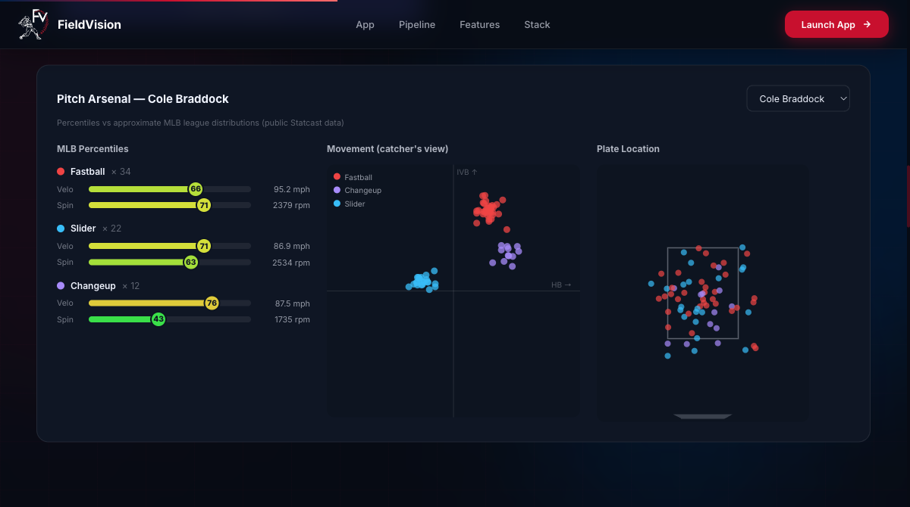

# FieldVision — Baseball Scouting Intelligence

AI-assisted scouting platform built around a principle pro evaluators actually care about: **show your evidence**. Every grade traces back to the exact note sentences and Trackman numbers that produced it, confidence is computed from evidence availability (never self-reported by the model), the system flags when notes and data disagree — and the human scout owns the final evaluation.

**Live:** https://fieldvision-personal.onrender.com · Baseball capstone origin: Saint Mary's College of California


---

## The Evidence Chain

Every scouting report separates four epistemic layers, per tool:

| Layer | Example |
|---|---|
| **Observation** | *"Fastball played with late life up in the zone"* (verbatim note quote) |
| **Measurement** | 94.2 mph avg, 2,390 rpm — from session Trackman data |
| **Interpretation** | Above-average riding fastball |
| **Projection** | Potential bat-missing weapon if command holds *(most uncertain layer, hedged)* |

Plus, per tool and overall:
- **Computed confidence** (High/Medium/Low) — derived server-side from evidence count + measurement availability, not model self-assessment
- **Conflict detection** — ⚠️ flags when notes and Trackman data genuinely disagree
- **Scout override** — the scout can correct any grade with a reason; AI assessment and scout override display side by side
- **Take / Follow / Hold recommendation** and **"What would change this evaluation?"** — the information-gap section
- **Player Decision Report** — exports as a front-office-style artifact: tools table, evidence, risk, overrides, sources, timestamps

## Baseball features

- **Scouting Notes** — PDF/TXT upload (handwritten PDFs via a pdfplumber → pypdf → Claude Vision OCR fallback chain) or pasted text; `---` separates players. Reports grounded in **1,919 Branch Rickey historical scouting documents** (TF-IDF RAG)
- **Trackman** — instant pitch charts, zero LLM cost: MLB percentile sliders (velo + spin vs approximate league distributions — labeled as approximations), movement plot (IVB/HB, catcher's view), plate location with strike zone; AI interpretation on demand
- **Compare** — head-to-head AI verdict on any two scouted players: category edges, risk profiles, who to take first
- **Players** — session talent pool with grade badges, search, filters; **persists across refreshes** (localStorage)
- **Combined Chat** — session-wide Q&A, **streamed word-by-word** (SSE)
- **One-click demo data** everywhere — the platform demos with zero files




---

## Basketball module — proving the architecture generalizes

The same pipeline (notes → RAG comps → structured report → coaching chat) was ported to basketball to test sport-agnosticism, plus one sport-specific showpiece: **Play Maker** — drag five dots on an SVG half court, describe each player's strengths, and the AI designs a set play the dots then run as an animation with live coaching captions.


Also: box score CSV analysis (PPG/RPG/APG/TS%), a four-mode coaching assistant, and stat comps from 5,080 NBA player-seasons (1986–2026) with scouting-language descriptor tags and name-excluded indexing.

---

## Tech

| Layer | Technology |
|---|---|
| Frontend | Single-page HTML / Tailwind / vanilla JS + SVG; SSE streaming reader |
| Backend | FastAPI (Python 3.11) |
| AI | Anthropic Claude (Sonnet; Opus for Vision OCR). Structured-JSON evaluations with server-side validation, evidence verification against source text, and computed confidence |
| RAG | scikit-learn TF-IDF, dual indexes (deliberate zero-heavy-dependency choice for fast cold starts; see design notes below) |
| Guardrails | Per-IP rate limiting, size caps, env-driven CORS |
| CI | GitHub Actions — ruff + pytest on every push |
| Tests | 28+ pytest cases, all runnable without an API key |

### Design notes
- **Evidence verification:** quoted evidence is checked to be a verbatim substring of the source notes; unverifiable quotes are marked.
- **Confidence is rules, not vibes:** ≥2 verified quotes + measurement → High; quotes or measurement alone → Medium; thin → Low.
- **TF-IDF over embeddings, deliberately:** zero-dependency deploys and fast cold starts on small hosting; stat rows are converted to scouting-language blurbs (with position words and derived descriptors) so free-text notes can match them. Embedding upgrade is planned behind a retrieval evaluation harness, not vibes.
- **Percentiles are labeled approximations** vs public league distributions — transparency over fake precision.

---

## Run locally

```bash
python3 -m venv .venv && .venv/bin/pip install -r requirements.txt
cp .env.example .env   # add your ANTHROPIC_API_KEY
.venv/bin/uvicorn backend.main:app --port 8001
```

Tests: `.venv/bin/pip install -r requirements-dev.txt && .venv/bin/python -m pytest tests/`

Deploy: `render.yaml` blueprint included — point Render at this repo, set `ANTHROPIC_API_KEY`.

## Project structure

```
FieldVision-personal/
├── index.html                     # SPA: landing + baseball + basketball
├── backend/
│   ├── main.py                    # FastAPI entry + guardrails middleware
│   ├── routes/                    # analyze, chat, trackman, trackman_viz, compare, basketball
│   └── services/
│       ├── scout_report.py        # Evidence Chain: structured eval + computed confidence
│       ├── claude.py rag.py files.py mlb_benchmarks.py
│       └── basketball.py rag_basketball.py
├── data/                          # Branch Rickey corpus + NBA season CSVs
├── static/demo/                   # one-click demo datasets
├── tests/                         # pytest (no API key needed)
└── .github/workflows/ci.yml
```
