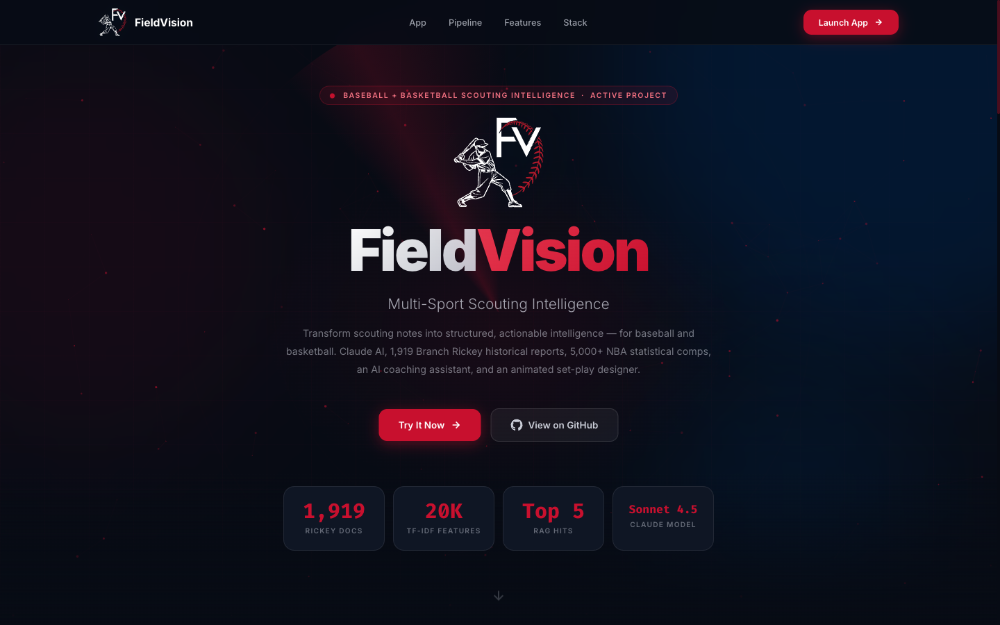
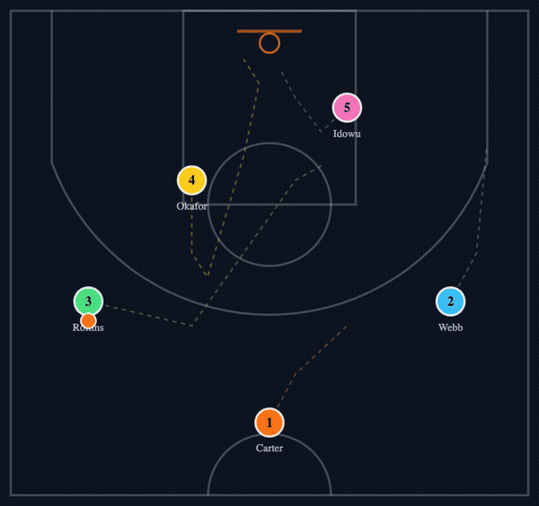
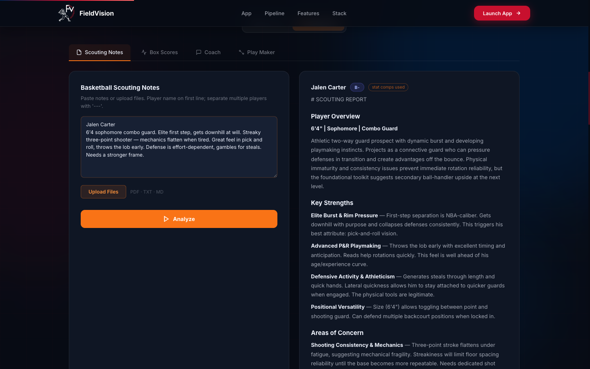

# FieldVision — Multi-Sport Scouting Intelligence

AI-powered scouting platform. Started as a baseball capstone for Saint Mary's College of California; this personal fork adds a full **basketball scouting + coaching suite** with an **animated AI play designer**.



---

## 🏀 Play Maker — AI-designed set plays, animated

Drag five dots into your set, describe each player's strengths, give an objective — Claude designs a play around the lineup and the dots run it on the court with live coaching captions.



How it works: player positions + strengths + objective → Claude returns keyframe JSON (validated and clamped server-side) → SVG dots and ball interpolate along paths with action captions, dashed path previews, replay, and speed control.

---

## Features

### Basketball (new in this fork)
- **Scouting Notes** — paste or upload notes; structured report with grade, strengths, concerns, and **statistical comps pulled from 5,000+ NBA player-seasons** (Basketball-Reference per-game + advanced stats across 10 seasons, 1986–2026)
- **Box Scores** — upload game or season CSVs; per-player PPG/RPG/APG, shooting splits, and true-shooting with plain-language AI interpretation
- **Coach** — four modes: player development plans, opponent scouting, practice planning, open chat. Session scouting reports and box score data feed in automatically
- **Play Maker** — the animated set-play designer above



### Baseball (original capstone, untouched)
- Handwritten note OCR (Claude Vision fallback chain), Branch Rickey RAG (1,919 historical scouting docs), Trackman pitch analytics, talent pool with grade filtering, session-wide AI chat, PDF export

---

## Tech Stack

| Layer | Technology |
|---|---|
| Frontend | Single-page HTML / Tailwind CSS / vanilla JS + SVG animation |
| Backend | FastAPI (Python 3.11+) |
| AI / LLM | Anthropic Claude (Sonnet 4.5; Opus 4.5 for Vision OCR) |
| RAG | scikit-learn TF-IDF — dual indexes (Rickey docs + NBA stat blurbs) |
| Data | Pandas + NumPy; Basketball-Reference season exports |
| Guardrails | Per-IP rate limiting, request size caps, env-driven CORS |
| Tests | pytest — box score math, play JSON validation, RAG blurbs |

### RAG design note
Stat rows don't share vocabulary with free-text scouting notes, so each player-season row is converted to a blurb with **derived scouting-language descriptors** ("high volume scorer", "rim protector", position words) before TF-IDF indexing — and **player names are excluded from the search index** so a prospect named Carter doesn't false-match NBA Carters.

---

## Run locally

```bash
python3 -m venv .venv && .venv/bin/pip install -r requirements.txt
cp .env.example .env   # add your ANTHROPIC_API_KEY
.venv/bin/uvicorn backend.main:app --port 8001
```

Open http://localhost:8001 — flip the ⚾/🏀 toggle in the app section.

Tests: `.venv/bin/pip install -r requirements-dev.txt && .venv/bin/python -m pytest tests/`

To refresh the basketball RAG, drop any Basketball-Reference/Stathead-format CSVs into `data/basketball/` and restart (index caches at first query).

---

## Deploy (Render)

`render.yaml` blueprint included:
1. Render dashboard → New → Blueprint → point at this repo
2. Set `ANTHROPIC_API_KEY` when prompted (never committed)
3. Optionally set `FV_ALLOWED_ORIGINS` / `FV_RATE_LIMIT`

---

## Project Structure

```
FieldVision-personal/
├── index.html                       # Full frontend (SPA: landing + baseball + basketball)
├── backend/
│   ├── main.py                      # FastAPI entry, guardrails middleware
│   ├── routes/
│   │   ├── analyze.py  chat.py  trackman.py     # baseball (original)
│   │   └── basketball.py            # /api/basketball/{analyze,boxscore,coach,play}
│   └── services/
│       ├── claude.py  rag.py  files.py           # baseball (original)
│       ├── basketball.py            # basketball prompts + play designer
│       └── rag_basketball.py        # NBA stat-comp RAG
├── data/
│   ├── branch-rickey-scouting.csv   # baseball knowledge base
│   └── basketball/bbref_*.csv       # 10 seasons of NBA stats (5,080 players)
├── tests/                           # pytest suite (no API key needed)
└── render.yaml                      # one-click Render blueprint
```
